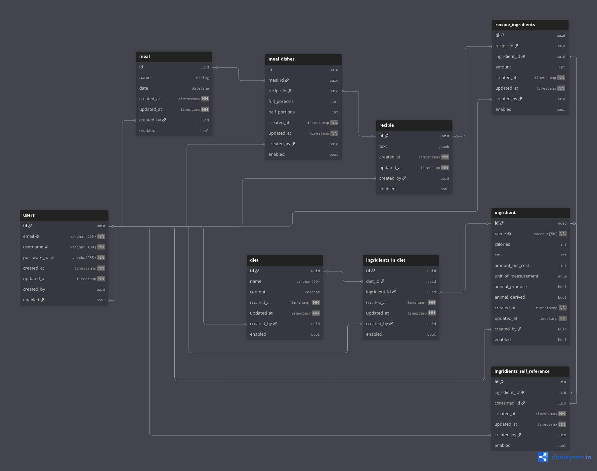

[](https://codecov.io/gh/Kinggred/MealList)
# MealList API
## Goals

The goal of this application is to streamline organization in a professional kitchen.

MealList allows users to register ingredients, including their cost, caloric value, and other nutritional information, and combine them into recipes. Recipes can then be used to plan meals for a specific number of servings while taking dietary requirements into account through diets.

By linking ingredients, recipes, meals, and diets together, MealList can automatically generate shopping lists, calculate ingredient requirements, and estimate total costs for planned meals.

---

## Vocabulary

- **Ingredient** – A specific product or produce item.
- **Recipe** – A collection of ingredients with quantities specified per single serving.
- **Dish** – A specified number of servings of a recipe.
- **Meal** – One or more dishes planned to be served at the same time.
- **Diet** – A set of rules defining which ingredients are allowed or disallowed.

---

## Ingredient Connectivity

To simplify diet management, ingredients can be connected to one another through self-referencing relationships.

These relationships can represent:

### Containment

An ingredient may contain another ingredient.

Example:

```text
Butter → contains → Milk
```

This allows dietary restrictions to propagate correctly. A customer avoiding milk products should also avoid butter.

### Alternatives

An ingredient may be marked as an alternative to another ingredient.

Example:

```text
Butter ↔ Margarine
```

This enables recipe substitutions and dietary adaptations.

---

## Authentication & Authorization

MealList currently uses OAuth2 Password Bearer authentication.

### Permissions

- All authenticated users can read all resources.
- Resources may only be modified by their authors.
- Authentication is required for creating, updating, or deleting resources.

---

## Database Schema



---

## Planned Features

- Recipe management [x]
- Meal planning calendar [x]
- Diet management [x]
- Shopping list generation [x]
- Cost estimation [x]
- Nutritional analysis []
- Inventory tracking []
- Ingredient substitution recommendations [x]